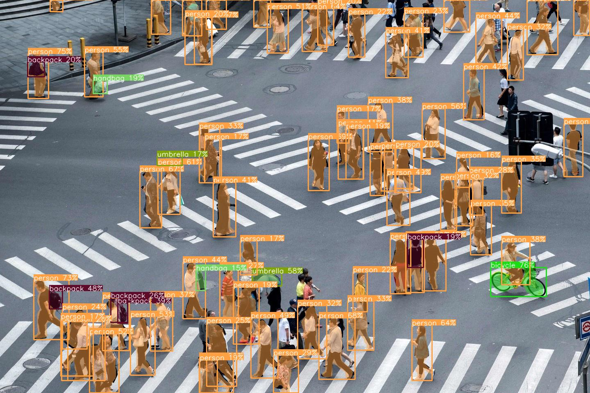
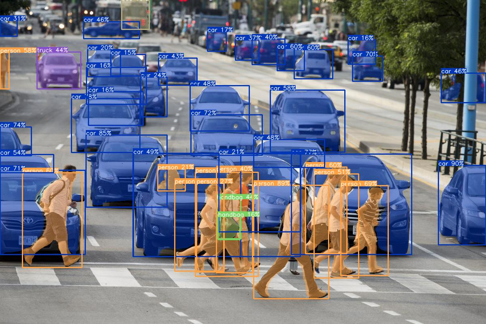

# Image segmentation API
This is a simple API for performing image object segmentation using YOLO segmentation model.
The API takes an input image and returns processed image with predicted classes.

## Installation
1. Clone the repository:

```
git clone https://github.com/Shazy021/Image-Segmentation-API.git
```

2. You can change the IP address or port in `docker-compose` and `Dokerfile` files:
    * In docker-compose.yml you can change port `ports:- "8080:80"`
    * In Dockerfile yo can change uvicorn parameters:
```
CMD ["uvicorn", "app:app", "--host", "0.0.0.0", "--port", "80", "--workers","4"]
```

3. Docker compose:
```
docker-compose up
```

API will be accessible at http://localhost:8080

## Usage
### Request
Send a POST request to http://localhost:8080/process_image with following parameters:

- file: The input image file to be processed

### Response

The API responds with a JSON object containing following fields:

- processed_image: Processed image in array format
- classes: Predicted classes in an array format

## Interacting with API
Below is an example of how to interact with API using Python:
```
import requests
from PIL import Image
import matplotlib.pyplot as plt
import numpy as np
import json

# Define path to image you want to process
image_path = "./data/test.png"

# Create request parameters
files = {"file": open(image_path, "rb")}

# Send a POST request to API endpoint
response = requests.post("http://localhost:8080/process_image", files=files)

# Check response status code
if response.status_code == 200:
    # Get processed image
    processed_image = json.loads(response.content)

    # Display processed image
    plt.imshow(processed_image['processed_image'])
    plt.show()

    # Print predicted classes
    print(processed_image['classes'])
else:
    # Handle error if request fails
    print(f"Error {response.status_code}: {response.text}")
```
## Example
### Original:

<p align="center">
  
</p>

<p align="center">
  
</p>

### Processed imgs:

<p align="center">
  
</p>

<p align="center">
  
</p>

## Contributing

Contributions are welcome! If you find any bugs or have any suggestions, please feel free to open an issue.

## License

This project is licensed under the [MIT License](LICENSE).
